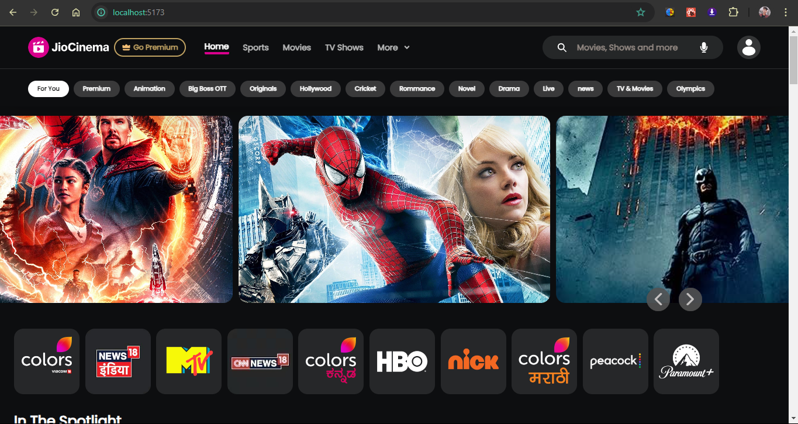
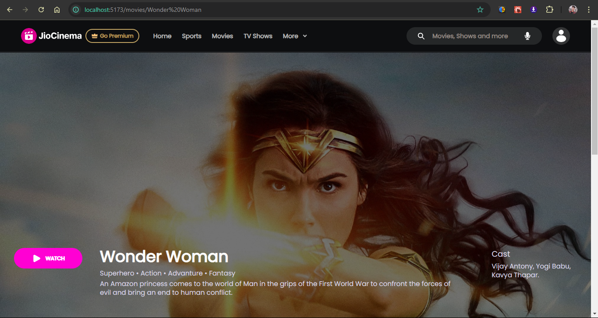
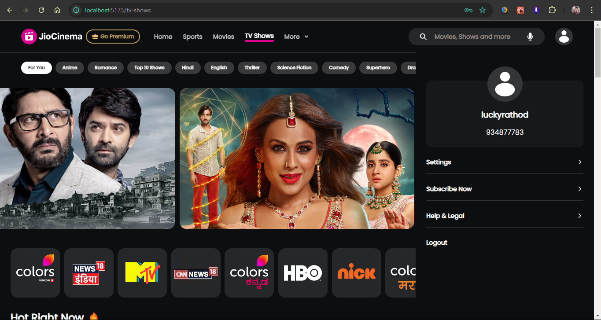

# JioCinema Clone - A MERN Stack Project 🎬

## Introduction

This repository contains the source code for my JioCinema clone, a full-stack web application built using the MERN (MongoDB, Express.js, React.js, Node.js) stack.
This web-app clones the features of JioCinema, a popular streaming platform. The app allows users to browse, search, and watch movies and TV shows with a seamless user experience.

## Features 🌟

- **Browse Movies and TV Shows:** Explore a vast catalog of movies and TV shows.
- **Dynamic Content Loading:** Enjoy a seamless browsing experience with content fetched dynamically based on user interactions.
- **Content Recommendations:** Discover similar movies and TV shows based on genre, ratings, language, and more.
- **Search Functionality:** Easily find your favorite content using the search bar.
- **User Authentication:** Implement user accounts for a more personalized experience.

## Technologies Used 🚀

**Frontend:**

- React.js
- Swiper.js
- Tailwind CSS
- TailwindCSS-Components
- Redux-Toolkit.js
- React-Router-Dom.js
- React-Player
- Axios.js
- Hero-Icons
- HTML
- CSS
- JavaScript

**Backend:**

- Node.js
- Express.js
- Mongoose.js
- Bcrypt.js
- Nodemon
- CORS
- Dotenv
- GoogleAPIs
- UUID
- Jsonwebtokens
- Axios

**Database:**

- MongoDB

**API:**

- YouTube Data API
- Rapid API
- TVmaze Data API
- OMDB Data API

**Authentication:**

- JWT (JSON Web Tokens)

**Deployment:**

- Vercel
- Netlify

**Quick Demo**

Check out the quick [demo here](https://jiocinema-clone-two.vercel.app)

## Getting Started 🛠️

**Prerequisites:**

- Node.js
- npm (Node Package Manager)
- MongoDB

1. **Clone the repository:**

   ```bash
   git clone https://github.com/laxman-rathod/JioCinema.git

   ```

2. **Navigate to the project directory:**

   ```bash
   cd JioCinema

   ```

3. **Install dependencies (client and server):**

   ```cd client && npm install
    cd ../server && npm install

   ```

4. **Set up environment variables:**

   - Create .env files in both the client and server directories.
   - Add your API keys, database connection string, and other necessary configurations.

   ```
   MONGO_URI=your_mongodb_connection_string
   JWT_SECRET=your_secret_key

   ```

5. **Start the development servers:**

   # In the 'client' directory:

   ```
   npm start
   ```

# In a separate terminal, in the 'server' directory:

```
npm start
```

## Usage

Open your browser and go to http://localhost:[8000].
Register a new account or log in with an existing account.
Browse, search, and watch movies and TV shows.

## Screenshots

**Home Page:**


**Movies Info:**


**User Profile**


## Project Structure 📂

- client/: Contains the React.js frontend application.
- server/: Contains the Node.js/Express.js backend API.

## Future Enhancements 🚀

- Implement features uploading, downloading movies and live streaming.
- Add features like watchlists, ratings, and reviews.
- Integrate a payment gateway for subscription services.
- Improve the UI/UX design and responsiveness.

## Contributing 🤝

Contributions are welcome! If you find any bugs or have suggestions for improvement, please feel free to create an issue or pull request.

## License 📝

This project is licensed under the [MIT License](LICENSE).
